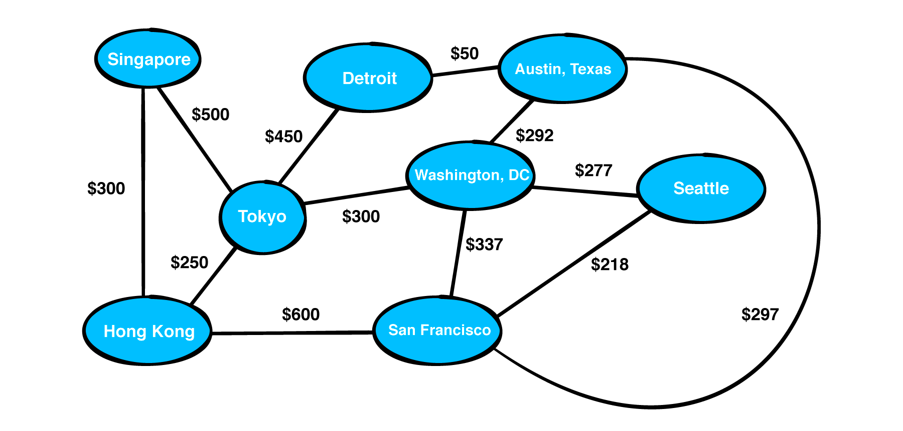

# Basic algorithms for Graph traversals 
### With an airport map as an example

Here is what the map looks like:

_Source:_ https://www.kodeco.com/books/data-structures-algorithms-in-kotlin/v1.0/chapters/19-graphs